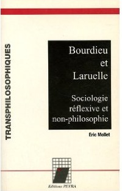
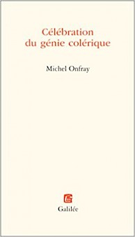

Полезный [библиографический список](http://www.bnf.fr/documents/biblio_bourdieu.pdf), составленный в 2012 году, к 10-летию со смерти П. Бурдье.

Из неожиданных работ о Бурдье:

Эрик Молле. Бурдье и Ларюэль: рефлексивная социология и не-философия. ([Bourdieu et Laruelle : Sociologie réflexive et non-philosophie](http://www.amazon.fr/Bourdieu-Laruelle-Sociologie-r%C3%A9flexive-non-philosophie/dp/2847430024)).

И, к примеру, «Надгробная речь» Мишеля Онфре «Во славу гения-холерика» (очевидно, сближение Онфре-Бурдье прошло по теме народа, которого забыли французские левые интеллектуалы) ([Célébration du génie colérique] (http://www.amazon.fr/C%C3%A9l%C3%A9bration-g%C3%A9nie-col%C3%A9rique-Michel-Onfray/dp/2718605588/)).

