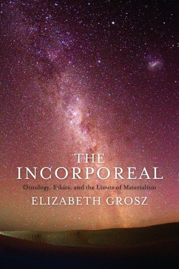

Известная феминистска старой закалки и теоретик Элизабет Грос выпустила в 2017 году книгу, в которой развиты ее рефлексии о Делезе.

["Бестелесное: онтология, этика и границы материализма"](https://cup.columbia.edu/book/the-incorporeal/9780231181624)

Приведем цитату из четвертой главы "Делез и план имманентности":

>>Ethics, for Deleuze, and others I discuss, is based on a knowledge of the implications and consequences of living a life here, in this world, with its own forces with which ours are bound up. Foucault well understood that Deleuze’s ontological and historical writings were in fact ethical texts as well. In his preface to the English translation of Anti-Oedipus. Capitalism and Schizophrenia, vol. 1,4 he states: “I would say that Anti-Oedipus (may its authors forgive me) is a book of ethics, the first book of ethics to be written in France for quite a long time” (xiii). 
While not the first book of ethics to be written in France for a long time (Foucault forgets here the work of Levinas), it is perhaps Deleuze’s most explicitly ethically oriented book: all of his work, from his earliest writings on Hume, Empiricism and Subjectivity,5 to his final text with Guattari, What Is Philosophy?, are involved in the question of ethics, but an ethics that is reconfigured outside and beyond theories of good or moral laws or ethical obligations. This is an immanent ethics of joy, an ethics enhanced and made more powerful the greater our understanding of the world is and the greater our power of acting in it. It is an ethics that is an elaboration, a maximization, of the ontological forces which support and enable life.6 Such an ethics cannot be conflated with norms, universal principles of thought or action, ideals of behavior, or even medical prescriptions, as many of Deleuze’s critics have assumed any ethics should be; 7 rather, it is a broader view that makes no assumptions about health, well-being, happiness, or freedom in human life. It is a set of concepts that lie within how we live and that can be developed only in our encounters with others and with the world and its forces. There is nothing prescriptive in his work, only an analysis, like his predecessors, of what is and can become, nothing of the “should,” but only the virtual “could.” 

