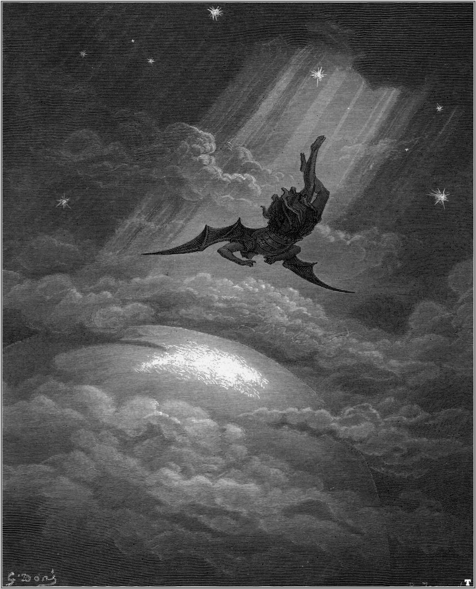

Известный британский политический философ Дэвид Рансиман [проанализировал](https://www.lrb.co.uk/v40/n22/david-runciman/the-us-is-not-hungary) промежуточные выборы в США в рамках общей логики американского института президентского правления. 

С точки зрения Расимана, нельзя сказать, что результаты midterms действительно аномальны. 

Цитата:

>>Whether Trump has been normalised or normality has been Trumpified, the prognosis looks the same. Presidents who lose their first midterms tend to go on to win a second term. It happened to Eisenhower, Nixon, Reagan, Clinton and Obama. Truman and Johnson didn’t try. Kennedy didn’t get the chance. Only Carter and George H.W. Bush failed. Incumbents still have huge advantages under the American system, because the opposition doesn’t get a leader to set its presidential agenda until very late in the day. That’s why it is so hard to defeat a party after one term in the White House but relatively easy after two, when the playing field has been levelled again. Trump could still destroy himself by some act of hubris. A severe economic downturn could yet wreck his chances of re-election. But we are left waiting on his next move. As I write this, he just fired Jeff Sessions.

Т.о. можно сделать вывод, что весь вопрос в том, насколько сама нормальность в эпоху Трампа может считаться вариантом аномалии.
