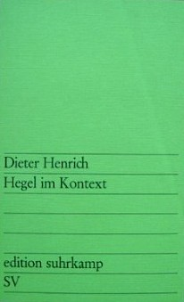

Один из наиболее часто упоминаемых у Жижека исследователей немецкого идеализма — Дитер Генрих. Например, в [Enjoy Your Symptom](https://books.google.ru/books?id=sQqPAQAAQBAJ&lpg=PA108&ots=mOakBYqX1r&dq=Dieter%20Henrich%20Reflexion%20in%20Hegel&pg=PA108#v=onepage&q=Dieter%20Henrich%20Reflexion%20in%20Hegel&f=false).

Знаменитая статья «Гегелевская логика рефлексии» была опубликована в [Hegel im Kontext](http://www.suhrkamp.de/buecher/hegel_im_kontext-dieter_henrich_29538.html):

Существует также фр. перевод этой статьи: Hegel et la logique de la réflexion, [part I](http://www.cairn.info/article.php?ID_ARTICLE=PHILO_090_0033&DocId=223995), [part II](http://www.cairn.info/article.php?ID_ARTICLE=PHILO_091_0024&DocId=39274).

Содержание:

Hegel und Hölderlin 9
1. Selbstsein und Hingabe in der Vereinigungsphilosophie 12
2. Hölderlins Weg zur philosophischen Grundlegung 18
3. Hegels Selbstverständigung mit Hölderlin 22
4. Strukturen in Hölderlins späterem Denken 30
5. Hegel und Hölderlin in Differenz 35

Historische Voraussetzungen von Hegels System 41
1. Rousseau und Kants Moraltheologie 44
2. Kantianismus und Bibelkritik 51
3. Hölderlins Systementwurf und Hegels früheste Probleme 61
Anfang und Methode der Logik 73
1. Die Kritik am Anfang 75
2. Die Struktur des Anfangs 85

Hegels Logik der Reflexion 95
I. Ziel und Methode der Logik 95
II. Analytischer Kommentar zur Logik der Reflexion 105
III. Methode und Aufbau der Logik 136
Hegels Theorie über den Zufall 157
1. Der Begriff des Zufalls in der Logik 157
2. Der Zufall in der Natur 165
3. Der Zufall im Leben des Geistes 171
4. Die Notwendigkeit des Seinsganzen und die Kontingenz des Seienden 180

Karl Marx als Schüler Hegels 187
Bibliographische Notiz des Autors 209

[Скачать](hegel-im-kontext.pdf)
